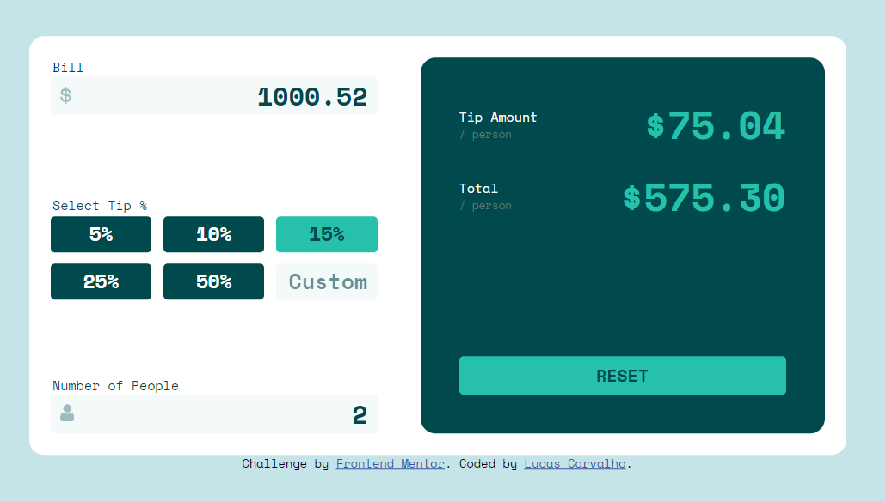
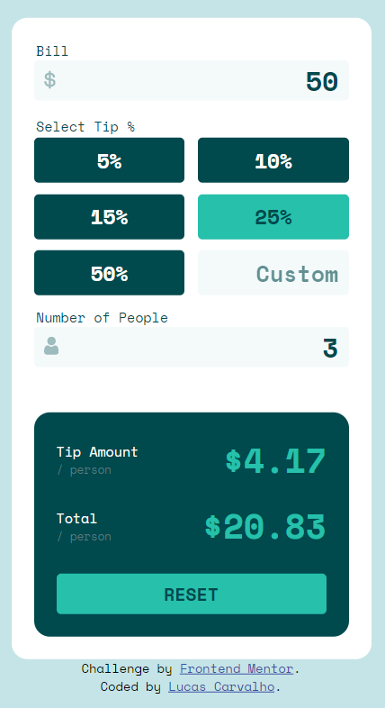

# Frontend Mentor - Tip calculator app solution

This is a solution to the [Tip calculator app challenge on Frontend Mentor](https://www.frontendmentor.io/challenges/tip-calculator-app-ugJNGbJUX). Frontend Mentor challenges help you improve your coding skills by building realistic projects.

## Table of contents

- [Frontend Mentor - Tip calculator app solution](#frontend-mentor---tip-calculator-app-solution)
  - [Table of contents](#table-of-contents)
  - [Overview](#overview)
    - [The challenge](#the-challenge)
    - [Screenshots](#screenshots)
    - [Links](#links)
  - [My process](#my-process)
    - [Built with](#built-with)
    - [Useful resources](#useful-resources)
  - [Author](#author)
  - [Acknowledgments](#acknowledgments)

## Overview

### The challenge

Users should be able to:

- View the optimal layout for the app depending on their device's screen size
- See hover states for all interactive elements on the page
- Calculate the correct tip and total cost of the bill per person

### Screenshots

### Links

- Solution URL: [GitHub](https://github.com/lucascc26/frontendmentor-01-tip_calculator)
- Live Site URL: [Vercel](https://frontendmentor-01-tip-calculator.vercel.app/)

## My process

### Built with

- HTML
- CSS
- Flexbox
- Vanilla Javascript

### Useful resources

- [CSS Flexbox Guide](https://css-tricks.com/snippets/css/a-guide-to-flexbox/) - Great guide for CSS Flexbox. I'd recommend it to anyone learning this concept.
- [Build A Calculator With JavaScript Tutorial](https://www.youtube.com/watch?v=j59qQ7YWLxw) - Tutorial to create a calculator with Javascript by Web Dev Simplified.
- [CSS Media Queries](https://css-tricks.com/a-complete-guide-to-css-media-queries/) Excellent guide for CSS Media Queries.

## Author

- GitHub - [Lucas Constante Carvalho](https://github.com/lucascc26)
- Frontend Mentor - [@lucascc26](https://www.frontendmentor.io/profile/lucascc26)
- Twitter - [@gugacc](https://www.twitter.com/gugacc)

## Acknowledgments

I was inspired by [Web Dev Simplified's Javascript Calculator](https://github.com/WebDevSimplified/Vanilla-JavaScript-Calculator). It helped me with CSS Flexbox, wiring Javascript to HTML and more.
